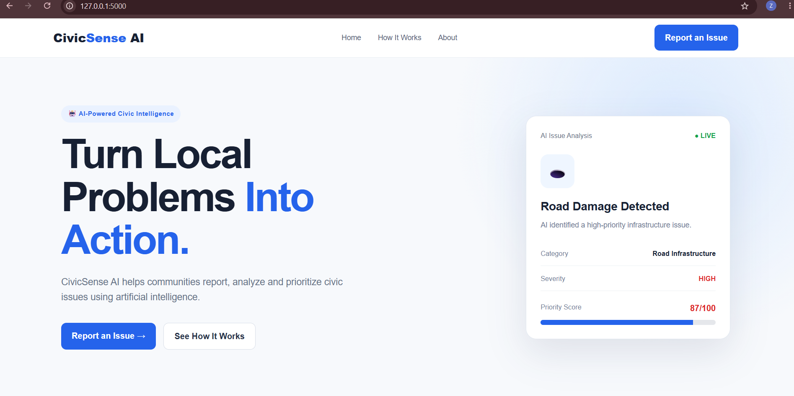
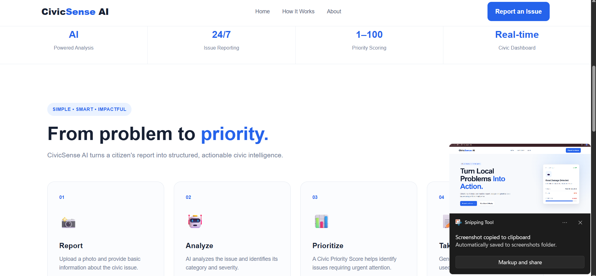
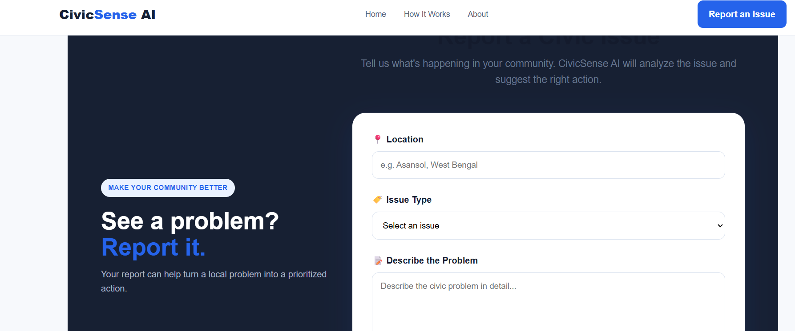
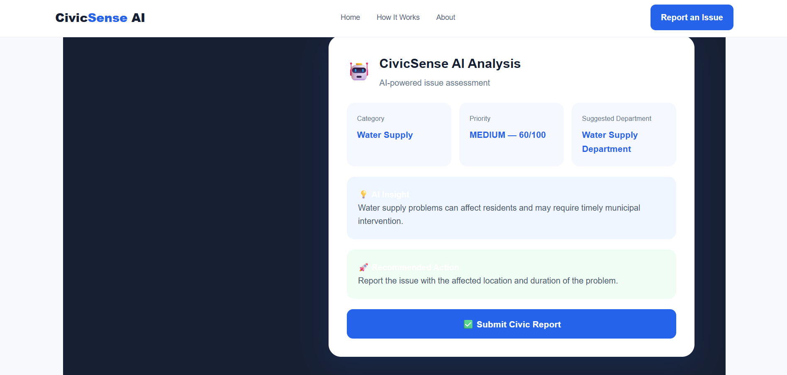
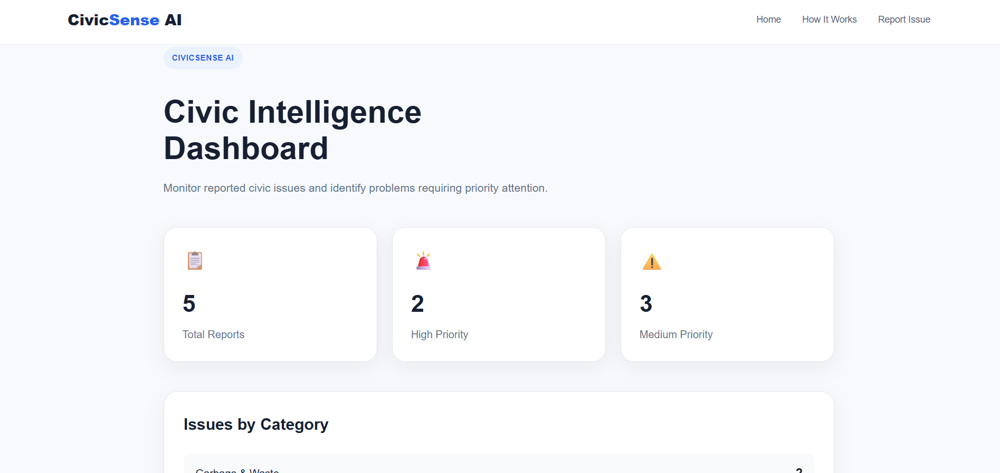
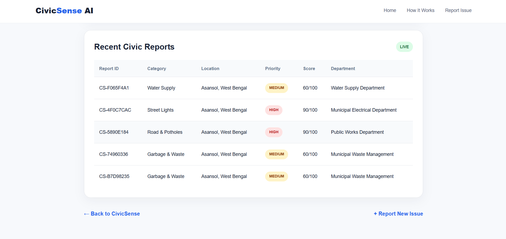
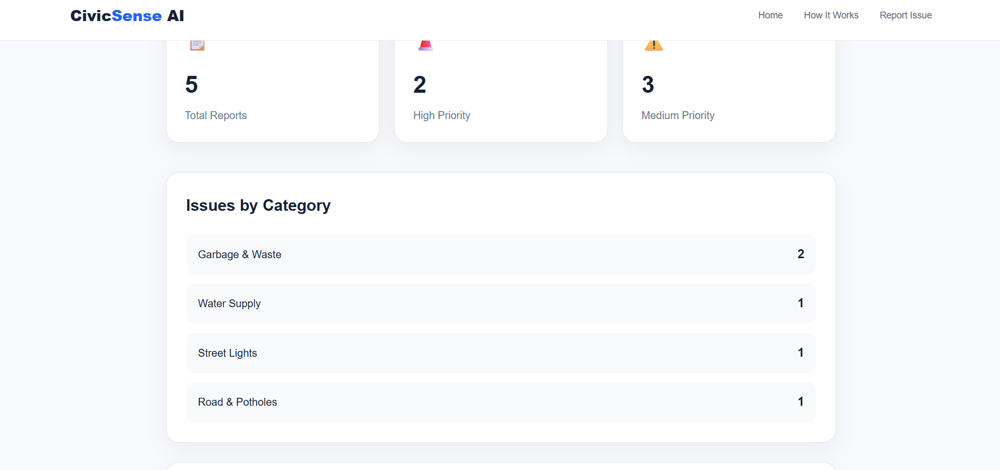

# 🚀 CivicSense AI

### AI-Powered Civic Issue Reporting & Community Monitoring Platform

**CivicSense AI** is a smart civic issue reporting platform designed to help citizens report local problems, understand their priority, and connect them with the appropriate civic department.

Built for **HackDevengers 1.0**.

---

## 🎯 Problem Statement

Citizens encounter everyday civic problems such as:

* 💡 Faulty street lights
* 🕳️ Potholes and damaged roads
* 🗑️ Garbage accumulation
* 🚰 Water leakage and supply issues
* 🏙️ Other local infrastructure problems

However, reporting these problems and tracking their importance can often be inconvenient and disconnected.

There is a need for a simple platform that allows citizens to **report civic issues and receive meaningful information about their urgency and appropriate department**.

---

## 💡 Our Solution

**CivicSense AI** provides a centralized platform where citizens can:

1. Report a civic issue.
2. Provide its location and relevant details.
3. Receive an intelligent issue assessment.
4. Get a priority score.
5. Identify the suggested responsible department.
6. Receive actionable recommendations.
7. Get a unique Report ID for tracking.
8. Monitor reported issues through a civic dashboard.

### 🔄 How It Works

```text
Citizen
   ↓
Report Civic Issue
   ↓
Issue Analysis
   ↓
Category + Priority Score
   ↓
Suggested Department
   ↓
Recommended Action
   ↓
Unique Report ID
   ↓
Civic Dashboard
```

---

## ✨ Key Features

### 📝 Civic Issue Reporting

Citizens can submit reports about local civic problems with relevant information such as issue type, description, and location.

### 🤖 Intelligent Issue Assessment

CivicSense analyzes the submitted issue and provides:

* Issue category
* Priority level
* Priority score
* Suggested department
* AI-generated insight
* Recommended action

### 🚦 Priority-Based Classification

Issues are assessed according to their potential urgency and community impact.

Example:

```text
Category: Street Lights
Priority: HIGH
Priority Score: 90/100
Department: Municipal Electrical Department
```

### 🆔 Unique Report ID

Every submitted issue receives a unique identifier, allowing citizens to keep a reference for their report.

Example:

```text
CS-4F0C7CAC
```

### 📊 Civic Dashboard

The dashboard provides a centralized view of reported civic issues and helps identify problems requiring priority attention.

### 📱 Responsive Design

CivicSense AI is designed to work across:

* 💻 Desktop
* 📱 Mobile
* 📟 Tablet-sized screens

---

## 🧠 Civic Intelligence

CivicSense AI transforms a simple complaint into actionable civic information.

For example:

**Input**

> Faulty street light near a residential area.

**Analysis**

```text
Category: Street Lights
Priority: HIGH — 90/100
Suggested Department: Municipal Electrical Department
```

**Insight**

> A faulty street light can reduce visibility and create safety concerns, particularly at night.

**Recommended Action**

> Report the faulty street light with its exact location or nearby landmark.

This helps turn raw citizen reports into **structured and actionable information**.

---

## 🛠️ Technology Stack

### Backend

* Python
* Flask

### Frontend

* HTML5
* CSS3
* JavaScript

### Database

* SQLite

### Development

* VS Code
* Python Virtual Environment
* Git & GitHub

---

## 📁 Project Structure

```text
CivicSense/
│
├── static/
│   ├── style.css
│   └── script.js
│
├── templates/
│   └── index.html
│
├── venv/
│
├── .gitignore
├── app.py
├── civicsense.db
├── README.md
├── requirements.txt
└── SUBMISSION_CHECKLIST.txt
```

> `venv/` is a local development environment and should not be uploaded to the repository.

---

## ⚙️ How to Run Locally

### 1. Clone the repository

```bash
git clone <YOUR-GITHUB-REPOSITORY-URL>
```

### 2. Open the project directory

```bash
cd CivicSense
```

### 3. Create a virtual environment

```bash
python -m venv venv
```

### 4. Activate the virtual environment

**Windows:**

```bash
venv\Scripts\activate
```

### 5. Install dependencies

```bash
pip install -r requirements.txt
```

### 6. Run the application

```bash
python app.py
```

### 7. Open the application

```text
http://127.0.0.1:5000
```

---

## 📱 Mobile Access

For testing the application on a mobile device connected to the same Wi-Fi network:

```text
http://<YOUR-COMPUTER-IP>:5000
```

---

## 🌟 Future Scope

CivicSense AI can be expanded with:

* 🗺️ Interactive civic issue maps
* 📍 GPS-based location detection
* 📸 Image-based issue recognition
* 🤖 Advanced AI-powered classification
* 📈 Civic analytics and trend detection
* 🔔 Real-time status notifications
* 🏛️ Integration with municipal authorities
* 👥 Citizen participation and community verification
* 📊 Administrative analytics dashboard

---

## 🌍 Impact

CivicSense AI aims to improve communication between citizens and civic authorities by making issue reporting:

**Simple → Structured → Prioritized → Actionable**

The long-term vision is to create a smarter and more transparent approach to community problem reporting.

---

## 🏆 Hackathon

### HackDevengers 1.0

**Project:** CivicSense AI

**Theme:** Open Innovation

Built with the goal of solving a real-world civic problem through technology.

---

## 👩‍💻 Team

**CivicSense AI Team**

Developed for **HackDevengers 1.0**.

---

## 📌 Project Status

**✅ Functional Prototype**

Core civic reporting, intelligent issue assessment, priority classification, report identification, and civic dashboard functionality have been implemented.
## 📸 Screenshots

### 🏠 Home Page





### 📝 Report Issue


### 🤖 AI Analysis


### 📊 Civic Dashboard



